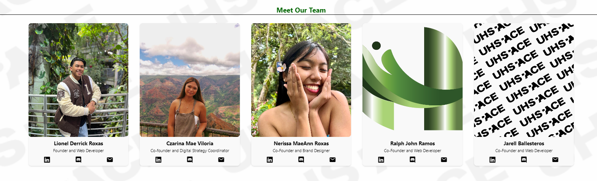

Choosing to be a software engineer wasn’t an obvious decision for me, but it’s a path that has come to feel incredibly natural. My journey has been influenced by personal experiences, a love for problem-solving, and a desire to make a real difference in people’s lives.

The spark for my career came from watching my brother, who works as a Project Engineer in the military. His ability to tackle complex projects and lead teams inspired me. Although his job is in a different field, the skills he demonstrated—like problem-solving and project management—were qualities I admired and wanted to develop in my own way.
I’ve always enjoyed thinking outside the box and immersing myself in solving problems. Whether it was a challenging puzzle or a personal goal, I’d dive in deeply until I found a solution. This kind of focused dedication seemed like a perfect match for software development, where creativity and problem-solving are key.

Originally, I majored in electrical engineering. While I appreciated the technical aspects, I didn’t quite feel at home. It became clear that my true passion was in helping people and leading projects that could make a difference. That’s when I decided to shift my focus to software development, a field where I could use my technical skills to create tools that benefit others.

One of my first projects was developing a point system app for my mom, a math teacher. She wanted a way to encourage student participation, and I created an app that rewarded students with points for their engagement. This project was not just a technical challenge but also a chance to make a tangible impact in my mom’s classroom, which was incredibly rewarding.
Today, I’m involved in several projects that allow me to combine my skills with my passion for making a difference. As a web developer for Manoa Now, I work on improving student life at UH Manoa by creating features that enhance campus engagement. My role with Hawaiiverse lets me connect with local businesses and support community outreach. These roles let me blend my technical expertise with my love for community service.

I’m also working on UHSpace, a platform designed to promote student-owned businesses and services. My goal is to turn UHSpace into an independent organization under UH Manoa, creating a lasting legacy that supports students and encourages entrepreneurship. This project perfectly aligns with my vision of using technology to empower others and make a meaningful impact.

In the end, my decision to become a software engineer has been shaped by a mix of inspiration from my brother, a love for problem-solving, and a desire to help others. By combining my technical skills with my entrepreneurial spirit, I’m dedicated to creating solutions that make a difference. Each project I work on brings me closer to achieving this vision, and I’m excited about where this journey will take me.
