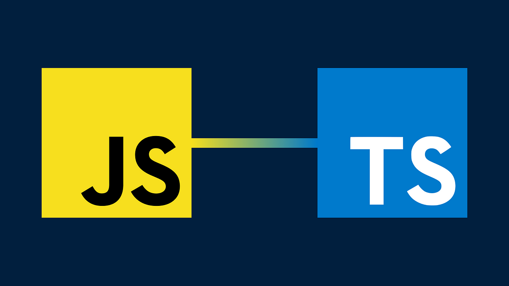

Learning a new programming language is always a mix of excitement, frustration, and ultimately, satisfaction when things start to click. My journey with TypeScript has been no different. As someone who is relatively new to TypeScript but not entirely new to programming, I found myself drawing comparisons to other languages I've worked with. This essay will explore my thoughts on TypeScript, its comparison with other languages, particularly ES6, and my experience with athletic software engineering, including the practice WODs (Workout of the Day).

Coming from a background where I’ve worked with JavaScript (ES6) and other languages, TypeScript initially seemed like "JavaScript with types." However, as I delved deeper, I realized it’s much more than that. TypeScript brings static typing to the dynamic world of JavaScript, which is both its most significant advantage and the steepest learning curve for those accustomed to loosely typed languages. In contrast to languages like Python or JavaScript, where types are inferred at runtime, TypeScript’s static typing forces you to think more about the structure of your data and the flow of your logic upfront. This leads to more robust code, less prone to runtime errors, but it can also feel restrictive at first. For instance, in one of my assignments, I had to implement a function to check if a string has all unique characters. This task would be straightforward in JavaScript, but TypeScript required me to be more explicit about types and logic, which ultimately led to cleaner and more maintainable code.

Although I was familiar with ES6 features like arrow functions, destructuring, and template literals, TypeScript introduced me to concepts like interfaces, generics, and advanced types, which were new territories for me. These features add a layer of safety and clarity that ES6 lacks. For instance, interfaces allowed me to define the shape of objects more precisely, leading to better code documentation and easier debugging.

One particular insight was the use of TypeScript’s type inference capabilities. While TypeScript is strict about types, it also smartly infers types where possible, reducing the need for excessive type annotations. This balance between strictness and flexibility is something I found to be a significant improvement over plain ES6 JavaScript.

From a software engineering perspective, TypeScript is an excellent language. Its type system catches errors at compile-time rather than at runtime, leading to more reliable and maintainable code. The strict type checking and interfaces promote better coding practices, especially in large-scale applications where JavaScript’s dynamic nature can become a liability.

However, this same strictness can be a double-edged sword, especially for beginners or those transitioning from more dynamic languages. The learning curve is steeper, and there are more rules to follow, which can feel cumbersome. Yet, once you get past the initial hurdles, the benefits become clear: fewer bugs, better tooling (thanks to TypeScript’s strong integration with IDEs), and more confidence in your codebase.

Athletic software engineering is a concept that emphasizes timed coding exercises, known as WODs (Workout of the Day), to build coding stamina and problem-solving speed. My experience with WODs has been a mix of frustration, learning, and eventual satisfaction.

For example, I attempted the WOD Euler Problem 1 four times. The first two attempts were discouraging; I couldn’t complete the problem within the 8-minute limit, which was disheartening. On my third attempt, I decided to draft the logic on paper first before coding. This approach helped, but I still didn’t solve the problem within the time frame. It wasn’t until my fourth attempt that I realized I had misunderstood the problem prompt, which is why my previous solutions were incorrect. Once I understood the problem, solving it took less than a minute.

This experience taught me the importance of thoroughly understanding the problem before diving into coding, a lesson that transcends TypeScript and applies to all programming. The WODs are undoubtedly stressful, as they impose a strict time limit, but they are also incredibly effective for learning under pressure. This style of learning pushes you to think quickly and adapt, which is valuable in real-world software engineering where deadlines and quick turnarounds are common.

In another assignment, I had to determine if a string contained all unique characters. I completed this task in about 8 minutes, which was a significant improvement. I attribute this success to better preparation; I drafted the logic on paper first and used tools like ChatGPT for guidance without relying on them for the entire solution. This approach reinforced my understanding and built my confidence in tackling similar problems.

In conclusion, TypeScript has proven to be a powerful language that enhances JavaScript with features that are particularly beneficial from a software engineering standpoint. Its static typing and advanced features promote better coding practices, which are essential for building reliable and maintainable applications. The athletic software engineering approach, while stressful, is an effective learning method. The timed WODs force you to think on your feet and refine your problem-solving skills under pressure. My experience with these exercises, though challenging, has been rewarding. They have taught me the importance of preparation, understanding the problem, and adapting my approach based on past mistakes. Combined with athletic software engineering practices, TypeScript has been a valuable addition to my programming toolkit. It has not only improved my technical skills but also my approach to problem-solving and coding under pressure.
