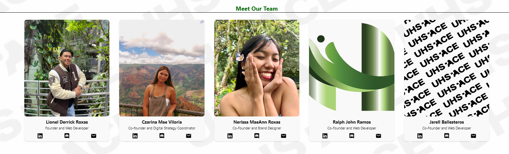
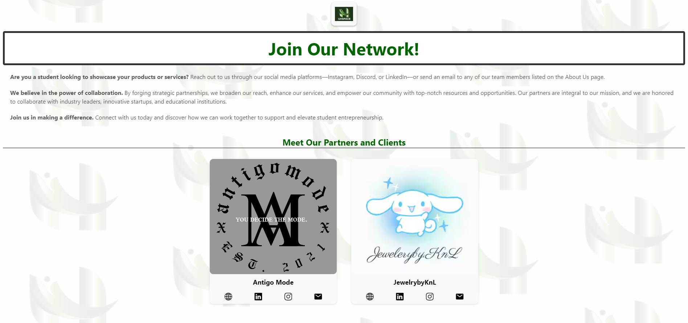

As CEO and Founder of UHSpace, <strong>our mission is to empower students by connecting them with valuable opportunities, collaborators, and mentors.</strong> We aim to bridge the gap between academic learning and real-world experience by providing a dynamic platform where student-owned businesses and services can thrive. Here, students can showcase their products, connect with customers, and collaborate with fellow entrepreneurs. We are dedicated to equipping students with the tools and resources they need to succeed in the marketplace, fostering a vibrant community of innovative and ambitious young business leaders.

At UHSpace, we believe in creating a supportive and inclusive environment where every member feels valued and inspired. Our community thrives on collaboration, creativity, and mutual respect, ensuring that each student has the opportunity to grow both personally and professionally. We prioritize the well-being and development of our members, offering a nurturing space that encourages exploration, innovation, and the pursuit of their entrepreneurial dreams.

<strong>We envision becoming the go-to platform for discovering and supporting student-owned businesses and services globally.</strong> We envision a future where every student entrepreneur has the opportunity to showcase their talent, grow their business, and make a significant impact on the economy and society. Our platform will connect customers with the next generation of innovative products and services, driving a new wave of student-led entrepreneurship. By building a network that fosters creativity and entrepreneurial spirit, we aim to transform the student business landscape, making student-led ventures a cornerstone of economic and social innovation.
