

  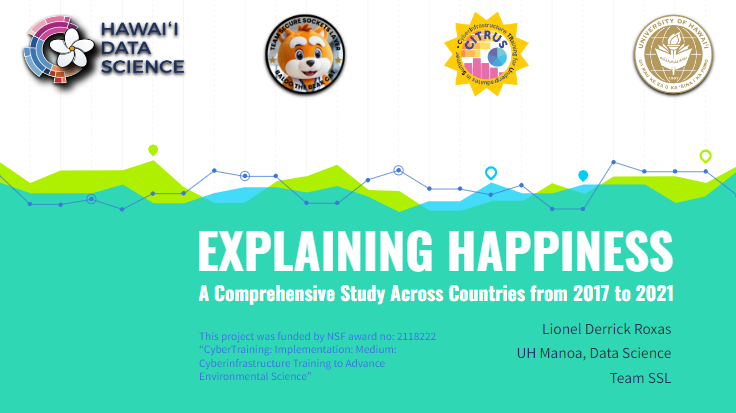
  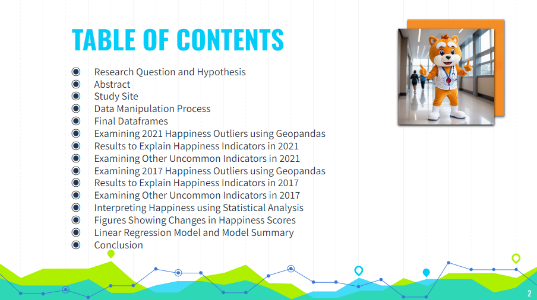

<h2>
  1. Research Question and Hypothesis
</h2>

  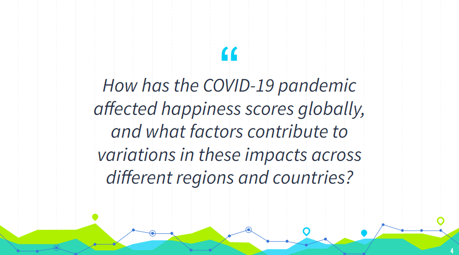
  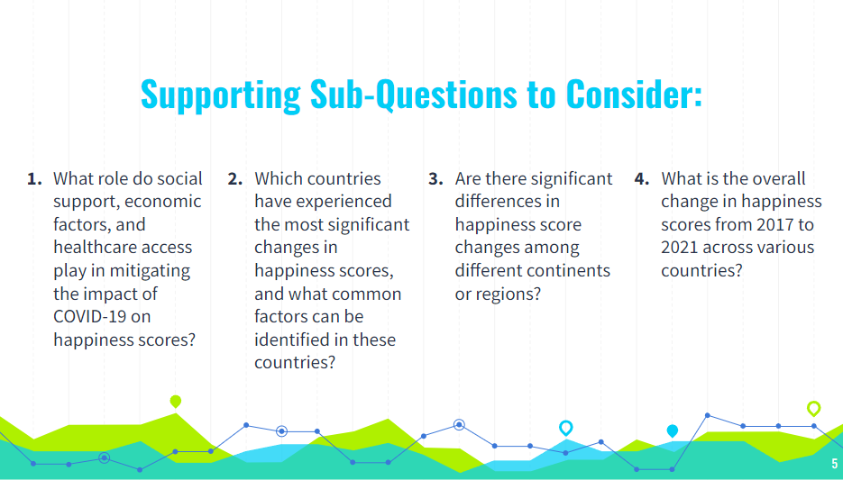
  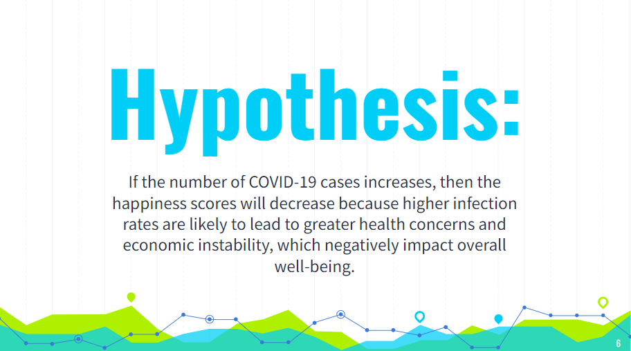

<h2>
  2. Abstract and Study Site
</h2>

  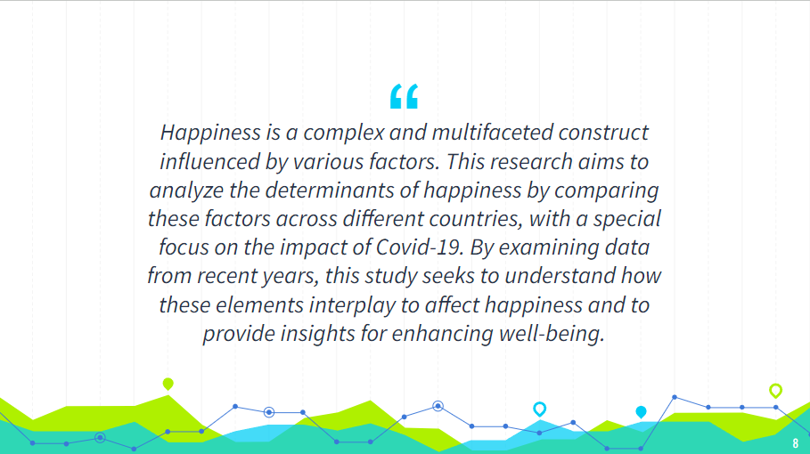
  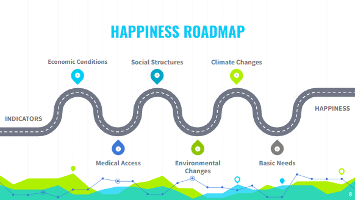
  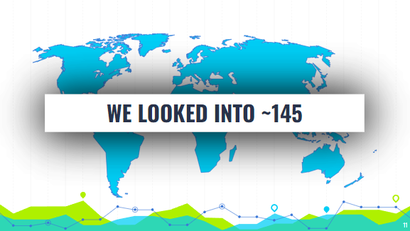
  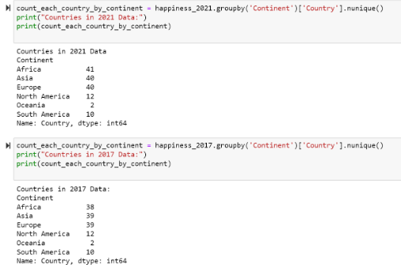

<h2>
  3. Data Manipulation Process and Final DataFrames
</h2>

  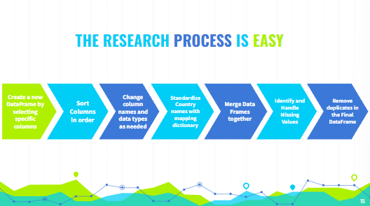
  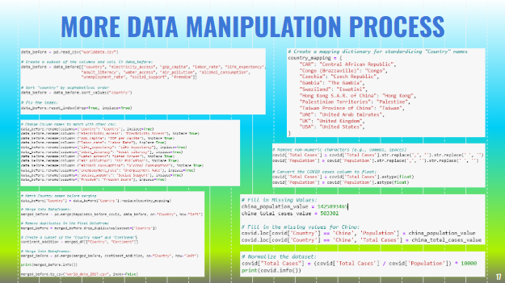
  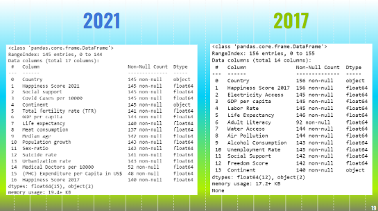
  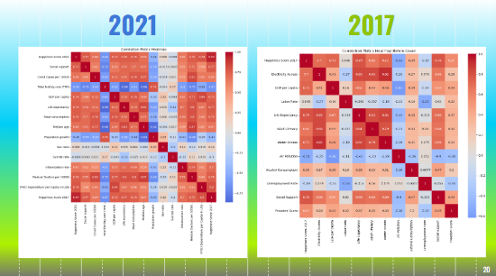

<h2>
  4. Examining Outliers using GeoPandas
</h2>

  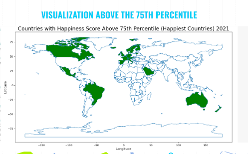
  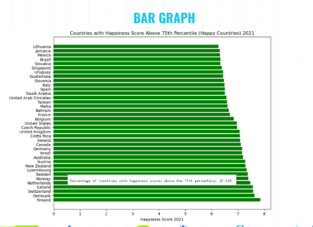
  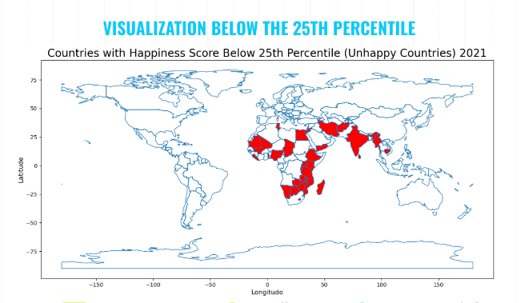
  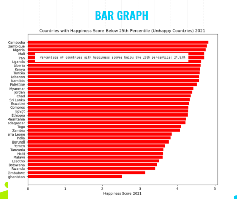

<h2>
  5. Results and Surprising Findings
</h2>
Check out the link below in HD Quality!
You can learn more at [NSF Presentations 2024](https://drive.google.com/file/d/1ikLQsq_8QDLau887foXSzSo-O-r7RRhI/view?usp=sharing).
