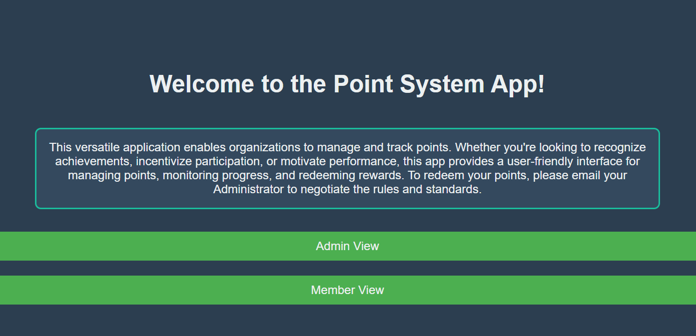
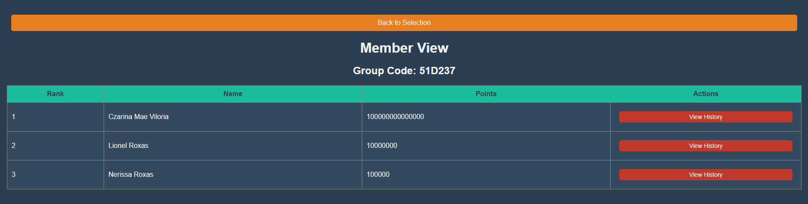

<div class="text-center p-4">
  
</div>

Inspired by the anime show "Classroom of the Elite," I developed this Point System App to help my mom, a math teacher at Nanakuli High School, incentivize student participation and foster a sense of healthy competition. The app allows teachers to reward students for their engagement, effort, and achievements, enhancing their motivation and creating a more dynamic learning environment. Beyond educational settings, the app is versatile enough to be used by businesses, clubs, and other organizations to encourage participation and recognize accomplishments.

<div class="text-center p-4">
  
</div>

For this project, I served as the lead developer, responsible for designing and implementing the app's core functionalities. I started by developing the backend using Node.js and Express, creating APIs to manage user authentication, student data, and point allocation. I also worked on integrating a MongoDB database to store and retrieve information efficiently. On the frontend, I used React to build a user-friendly interface, allowing admins and members to interact with the app seamlessly. I implemented features such as a group code system for secure student access, real-time updates to reflect point changes, and a leaderboard to display student rankings. By focusing on both the backend and frontend, I ensured a cohesive and scalable application that successfully engages users and meets their needs.

Here is some code that illustrates how we read values from the line sensors:

```cpp
byte ADCRead(byte ch)
{
    word value;
    ADC1SC1 = ch;
    while (ADC1SC1_COCO != 1)
    {   // wait until ADC conversion is completed   
    }
    return ADC1RL;  // lower 8-bit value out of 10-bit data from the ADC
}
```

You can learn more at the [UH Micromouse News Announcement](https://manoa.hawaii.edu/news/article.php?aId=2857).
